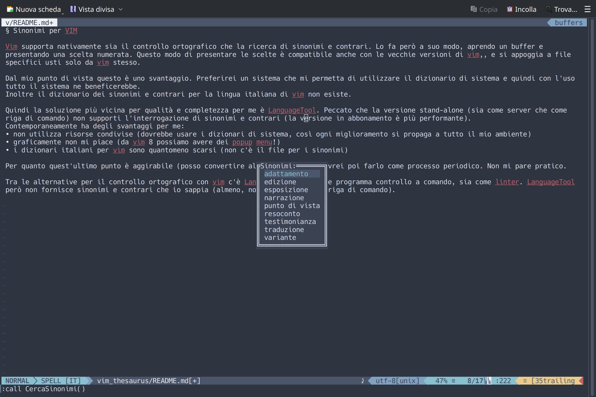

# Uno script per avere i sinonimi per VIM (Italiano ma usabile per altre lingue)

## Contenuti
1. [Perché](#perche)
2. [Prerequisiti](#prereq)
3. [Installazione e configurazione](#install)
4. [Utilizzo](#use)
5. [Da fare](#todo)
6. [Fonti](#fonti)

<a name="perche"></a>
## Perché
[Vim](https://www.vim.org) supporta nativamente sia il controllo ortografico che la ricerca di sinonimi e contrari. Per farlo però è necessario avere dei file specifici. Inoltre le scelte sono mostrate su buffers che nascondono completamente il testo su cui si sta lavorando.

A parte questo, trovare elenchi per sinonimi e contrari in Italiano è stato per me impossibile (guarda le [fonti](#fonti)).
<!-- Il problema più grosso è però doversi appoggiare a files specifici usati solo da vim. Files che in Italiano comunque non ci sono. Preferirei un sistema che mi permetta di utilizzare il dizionario di sistema e quindi con l'uso tutto il sistema ne beneficerebbe.-->

La seconda soluzione più vicina per qualità e completezza per me è [LanguageTool](https://languagetool.org/it). Peccato che la versione stand-alone (sia come server che come riga di comando) non supporti l'interrogazione di [sinonimi e contrari](#ltsyn) (la versione in abbonamento è più performante ma nemmeno quella, mi risulta, ha questa funzionalità quando interrogata, funziona solo come plugin).

Languagetool inoltre può essere usato da vim (anche come linter con ALE) e funziona bene anche se gli dai testo markdown.

Fortunatamente LibreOffice utilizza Hunspell/MySpell e c'è il supporto ai sinonimi attraverso [mythes](https://github.com/hunspell/mythes), inoltre questi sistemi sono fatti per essere disponibili a tutto il sistema, a prescindere dall'applicazione/interfaccia.

Invece di utilizzare mythes, ho preferito creare uno script che fa più o meno lo stesso lavoro, in questo modo posso avere un backend autonomo dal frontend (lo script vim che mi mostra e fa scegliere i sinonimi). Se poi volessi avere i sinonimi da un'altra fonte (ChatGPT, Minerva, Babelnet, etc) mi basterebbe scambiare il file da cui fare l'interrogazione.

Alla fine quello che viene fuori è:




<a name="prereq"></a>
## Prerequisiti
Vim, compilato con il supporto per i popup, altrimenti ovviamente non funziona.
Serve un file di thesaurus nella lingua desiderata. Per l'italiano io ho usato quello che viene con MySpell/LibreOffice/Hunspell. Il file è in formato testo.

Quindi come pre-requisti sono indispensabili:
* il file di thesaurus italiano che viene con MySpell o Hunspell
* vim versione 8.2 o superiore

<a name="install"></a>
## Installazione e configurazione

L'installazione è banalissima.
Il file bash (.sh) va nel path, quindi in una di queste location:  
```
~/.local/bin/
~/.bin/  
```
o se vi fidate direttamente in /usr/local/bin/.

Il file vim (.vim) va in ~/.vim/plugin/

Per configurarlo invece dovete verificare che i percorsi inseriti all'interno siano corretti. Sono comunque entrambi definiti come variabili all'inizio dello script. I percorsi da modificare sono :
1. nello script bash il percorso che punta al dizionario dei sinonimi di mythes che dovrebbe essere /usr/share/mythes/file.dat
2. uno nel file vim che punta allo script bash

<a name="use"></a>
## Utilizzo

Ci sono due script, quello che fa il lavoro di ricerca è quello bash. L'utlizzo è molto semplice:

```
> ./sinonimi.sh <termine di ricerca>
```

Se nessun termine viene trovato riporta come output: "Voce <termine di ricerca> non trovata."

Altrimenti ti offre una lista di alternative una sotto l'altra (vedi immagine più sopra).


<a name="todo"></a>
## Todo
* abilitare altre lingue (attraverso un file di configurazione)
* abilitare i contrari
* abilitare anche la possibilità di inserire nuovi termini
* usare più "dizionari" per diversificare i registri linguistici (termini specializzati, etc)

<a name="fonti"></a>
## Fonti
* [LanguageTool](https://languagetool.org/it)
* <a name="ltsyn"></a>[Sinonimi con LanguageTool](https://languagetool.org/insights/post/synonym-function/#:~:text=The%20synonym%20function%20is%20integrated,function%20in%20your%20global%20settings.)
* [Hunspell](https://hunspell.github.io/)
* [Babelnet](https://www.babelnet.org/guide)
 - [Python Interface](https://pypi.org/project/babelnet/)
* [WordNet](https://wordnet.princeton.edu/)
* [Shelldorado](http://www.shelldorado.com/)
* [Parole Italiane di Francesco Napoletano](https://github.com/napolux/paroleitaliane)
